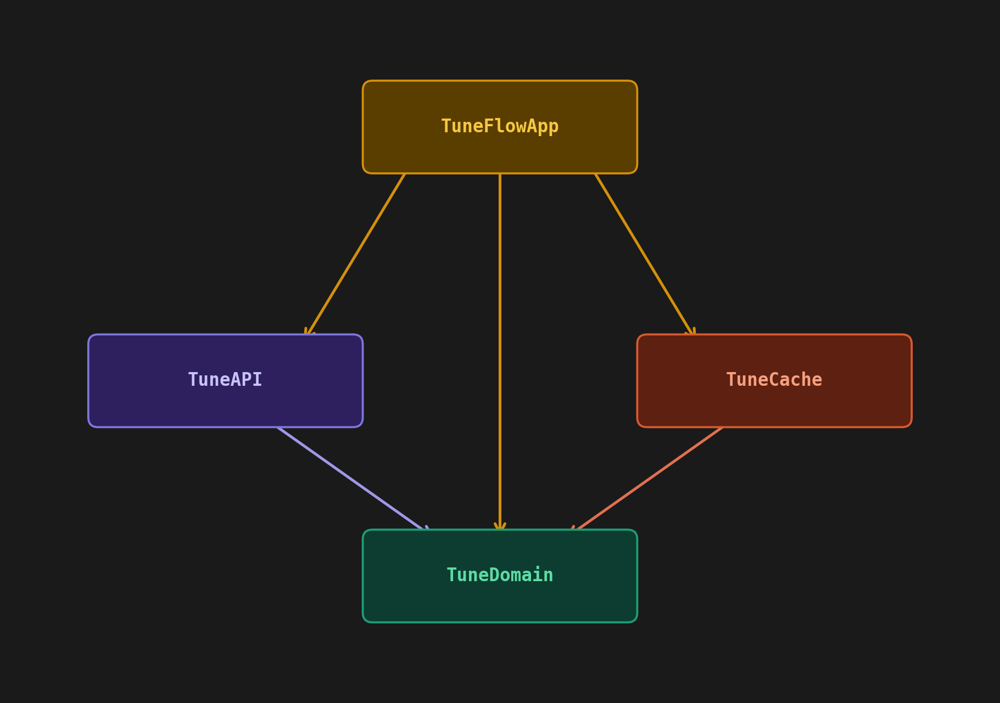

# TuneFlow

[](https://github.com/igdutra/tuneflow/actions/workflows/ci.yml)

TuneFlow is a SwiftUI music discovery app for searching songs, exploring albums, and previewing tracks using the [iTunes Search API](https://developer.apple.com/library/archive/documentation/AudioVideo/Conceptual/iTuneSearchAPI/Searching.html).

The project is built with an emphasis on **clean layered architecture**, **testability**, and an **offline-first experience**. It deliberately explores several iOS engineering patterns that are easy to get wrong at scale — type-safe navigation, deterministic async testing, SwiftData actor isolation, and protocol-based dependency injection — and makes the design decisions explicit through code and structure.

---

## Architecture

### Layered Package Structure

The codebase is split into three distinct layers, each with a strict dependency direction:

```
TuneDomain  ←  TuneAPI  ←  TuneFlow (app)
                              └── TuneCache
```

| Layer | Location | Responsibility |
|---|---|---|
| **TuneDomain** | `Packages/TuneDomain/` | Pure Swift domain models (`Song`, `Album`) and repository protocols. No framework dependencies. |
| **TuneAPI** | `Packages/TuneAPI/` | Network implementation. Maps iTunes JSON responses to domain models. Depends only on TuneDomain. |
| **TuneFlow** | `TuneFlow/` | SwiftUI presentation layer, SwiftData persistence, DI wiring, and navigation. |

The domain layer never imports UIKit, SwiftUI, or SwiftData — it owns the contracts, not the implementations.



### Composition Root

All dependency wiring happens in `TuneApp/Composers/`. Each screen has a dedicated composer that constructs the ViewModel with its real dependencies and returns an opaque `some View`:

```swift
// SongsComposer.swift
enum SongsComposer {
    static func compose(
        songRepository: any SongRepository,
        recentlyPlayedRepository: any RecentlyPlayedRepository,
        router: AppRouter
    ) -> some View { ... }
}
```

Views never know what concrete type backs their dependencies — the composer is the only site that knows about both protocols and implementations.

> `TuneUI` and `TuneCache` currently live inside the app target for simplicity, but their boundaries are clean enough to be extracted into separate Swift packages with minimal effort.

### Navigation — AppRouter, AppRoute, AppSheet

Navigation state lives in a single `@Observable` `AppRouter` class injected at the root. Routes are expressed as typed enums:

- `AppRoute` — push destinations (`.player(Song, queue:, currentIndex:)`, `.album(collectionId:)`)
- `AppSheet` — sheet presentations (`.moreOptions(Song)`)

ViewModels receive the router by reference and call `router.push(_:)` or `router.present(_:)` directly, keeping navigation logic out of views entirely.

### ViewState + stateOverlay Modifier

Each ViewModel exposes a `ViewState` enum (`idle`, `loading`, `loaded`, `error`) as its single source of truth for screen state. Views apply the `.stateOverlay(state:)` modifier rather than wrapping content in `if/else` branches:

```swift
List { ... }
    .stateOverlay(state: viewModel.state, errorTitle: "...", errorAction: .init(title: "Retry") { ... })
```

This preserves SwiftUI view identity across state transitions — the `List` stays mounted at all times and only the overlay layer changes. Replacing the root view on each state change would give branches different identities, forcing SwiftUI to destroy and remount the full subtree.

### Protocol-Based DI and the Spy Pattern

All external dependencies (`SongRepository`, `RecentlyPlayedRepository`, `AudioPlayerService`, `EventTracker`) are expressed as protocols. Tests use hand-written Spy objects that record every call with precise call counts and captured arguments:

```swift
final class SongRepositorySpy: SongRepository {
    private(set) var searchCallCount = 0
    private(set) var searchCalledWithQuery: String?
    // ...
}
```

This makes test assertions exact and intentional — `#expect(spy.searchCallCount == 1)` — rather than relying on mock frameworks.

### Injected launchTask — Deterministic Async Test Control

`PlayerViewModel` fires async work (saving to the recently-played repository) off the main actor using an internal `launchTask` closure that defaults to `Task { await body() }`. Tests override this closure to collect Task handles and `await` them after the triggering action, eliminating the scheduling race that otherwise causes intermittent failures:

```swift
sut.launchTask = { work in
    let t = Task { await work() }
    tasks.append(t)
}
```

No `Task.sleep`, no polling — the test waits for exactly the tasks it triggered.

### Offline-First — SwiftData with @ModelActor

Recently played songs are persisted using SwiftData. The store is implemented as a `@ModelActor` actor (`SwiftDataRecentlyPlayedStore`), which gives the model context its own serial executor and eliminates data races without manual locking. Fetch descriptors carry `SortDescriptor` so ordering is done by the persistent store, not in memory.

### Analytics Abstraction

The `EventTracker` protocol (defined in TuneDomain) decouples tracking from any specific backend. The app ships an `InMemoryAnalyticsTracker` that collects events in memory. Analytics closures are injected into ViewModels rather than passing the tracker directly, keeping TuneUI agnostic of the analytics domain entirely.

---

## Tech Stack

- Swift 6, SwiftUI, MVVM
- Swift Concurrency (`async/await`, `@MainActor`, `actor`)
- SwiftData (`@ModelActor`, `@Model`, `ModelContainer`)
- Protocol-based dependency injection
- Swift Testing (`#expect`, `#require`) — no XCTest
- GitHub Actions CI

---

## Features

- Search songs via iTunes Search API with paginated results
- Browse album details and track listings
- Preview tracks with a full-featured audio player (play, pause, seek, queue navigation)
- Cache recently played songs for offline-first access on launch
- More options sheet per track
- Dark mode, SF Pro typography, Dynamic Type support

---

## Running Tests

### App tests (requires simulator)

```bash
xcodebuild clean build test \
  -scheme TuneFlow \
  -destination 'platform=iOS Simulator,name=iPhone 17' \
  -testPlan "TuneFlowTestPlan" \
  CODE_SIGN_IDENTITY="" CODE_SIGNING_REQUIRED=NO
```

### Package tests (no simulator needed)

Tests live in `Packages/TuneAPI`. Two targets:

| Target | What it tests |
|---|---|
| `TuneAPITests` | Unit tests — no network, runs fast |
| `TuneAPIIntegrationTests` | Integration tests — hits the real iTunes API |

```bash
# Unit tests only
swift test --package-path Packages/TuneAPI --filter TuneAPITests

# Integration tests
swift test --package-path Packages/TuneAPI --filter TuneAPIIntegrationTests

# Both
swift test --package-path Packages/TuneAPI
```

---

## Typography

Mockups were designed with Articulat CF (DemiBold and Medium). The implementation uses native **SF Pro** via semantic SwiftUI text styles (`.body`, `.headline`, `.caption`) rather than hard-coded point sizes. This ensures Dynamic Type and accessibility support out of the box, and allows swapping the type ramp in one place if a custom font is licensed later.

---

## API Reference

- [iTunes Search API Documentation](https://developer.apple.com/library/archive/documentation/AudioVideo/Conceptual/iTuneSearchAPI/Searching.html)
